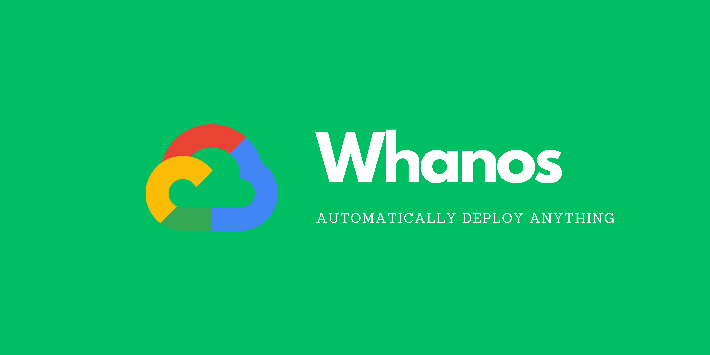

# Whanos 🚀⚙️🐳

Welcome to the **Whanos Project**! This project is a DevOps powerhouse designed to automate the deployment of applications with ease and precision. Inspired by legendary tools, Whanos is the ultimate infrastructure to containerize, deploy, and manage applications in Kubernetes clusters, triggered by a simple Git push.

---

## 🎯 Objective

Create an automated pipeline that:

1. Fetches code from a Git repository.
2. Identifies the application technology.
3. Builds a container image.
4. Pushes the image to a Docker registry.
5. Deploys the application in a Kubernetes cluster.

---

## 🚀 Features

- **Multi-language Support**:
  - C, Java, JavaScript, Python, and Befunge.
- **End-to-end Automation**:
  - From code to container to deployment.
- **Customizable Deployment**:
  - Configurable replicas, resource limits, and ports via `whanos.yml`.

---

## 🛠️ Tech Stack

This project leverages a robust DevOps stack:

- **Python**: Utility scripts for automation 
- **Terraform**: Master machine and cluster creation 
- **Ansible**: VM setup and configuration 
- **Jenkins (JCasC + JobDSL)**: CI/CD pipeline and job management 
- **GoogleCloud Registry**: Docker image registry 
- **Helm**: Kubernetes application deployment and updates 

---

## 📖 Usage

For detailed instructions on how to use this project, refer to the [Usage Guide](docs/USAGE.md).

## 🔗 Contributions

We welcome contributions! Please check out the [Contributing Guide](CONTRIBUTING.md) for setup instructions and contribution guidelines.

---

## ✨ Authors

- [Baptiste Moreau](https://github.com/BxptisteM)
- [Dragos Suceveanu](https://github.com/sdragos1)

---
